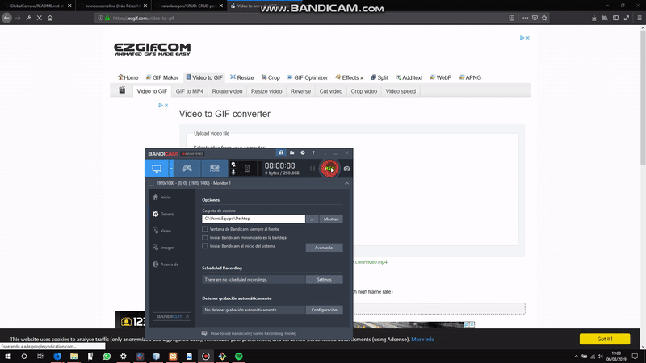

# GlobalCampo
Ayudamos al agricultor a gestionar su campo

### Idea del CRUD

El objetivo principal de este CRUD es hacer la vida más facil tanto al agricultor como al equipo de gestión de las cooperativas. Ya es hora de dejar de hacer las cosas a papel y pasarnos al mundo dígital

#### ☘COMENCEMOS☘

#

## Indice

Una vez ejecutamos el proyecto _GlobalCampo_ en NetBeans se nos abrirá la página _index.html_

En esta página simplemente encontramosuna portada del proyecto en el cual podemos acceder a las redes sociales del desarrollador y tenemos un botón **ENTRAR** el cual nos lleva al panel de control

?# Ejercicios de Java de Iván Pérez ????

Ejercicios de Java de la asignatura Programación de 1ºDAM en los cuales se ve mi evolución en el lenguaje JAVA.

#### Aquí tienes una lista de los temas que se estan tratando en clase. En cada enlace esta subida mi relación de ejercicios ?

* [Tema ? --> Salida de datos por pantalla](https://github.com/ivanperezmolina/ejercicios-de-java/tree/master/Tema01)
* [Tema ? --> Variables](https://github.com/ivanperezmolina/ejercicios-de-java/tree/master/Tema02)
* [Tema ? --> Lectura de datos desde teclado](https://github.com/ivanperezmolina/ejercicios-de-java/tree/master/Tema03)
* [Tema ? --> Sentencias condicionales(if y switch)](https://github.com/ivanperezmolina/ejercicios-de-java/tree/master/Tema04)
* [Tema ? --> Bucles](https://github.com/ivanperezmolina/ejercicios-de-java/tree/master/Tema05)
* [Tema ? --> Números aleatorios](https://github.com/ivanperezmolina/ejercicios-de-java/tree/master/Tema06)
* [Tema ? --> Arrays](https://github.com/ivanperezmolina/ejercicios-de-java/tree/master/Tema07)
* [Tema ? --> Funciones](https://github.com/ivanperezmolina/ejercicios-de-java/tree/master/Tema08)
* [Practicando para el examen 1º Trimestre ? ? ?](https://github.com/ivanperezmolina/ejercicios-de-java/tree/master/Practicando%20para%20Examen)
* [Ejercicios de POO. Parte ?](https://github.com/ivanperezmolina/ejercicios-de-java/tree/master/Ejercicios%20de%20POO)
* [Ejercicios de POO. Parte "Array de Objetos"](https://github.com/ivanperezmolina/ejercicios-de-java/tree/master/Arrays%20de%20objetos)
* [Ejercicios de Colecciones y Diccionarios](https://github.com/ivanperezmolina/ejercicios-de-java/tree/master/Colecciones%20y%20Diccionarios)
* [JSP ?](https://github.com/ivanperezmolina/ejercicios-de-java/tree/master/JSP)

Si se observa algún error; puedes comunicarmelo mediante el correo ivan.perez.8500@gmail.com

#### En este enlace podrás ver el libro con el que estamos aprendiendo APRENDE JAVA CON EJERCICIOS de Luis José Sánchez

[Aprende Java con ejercicios](https://leanpub.com/aprendejava/)
